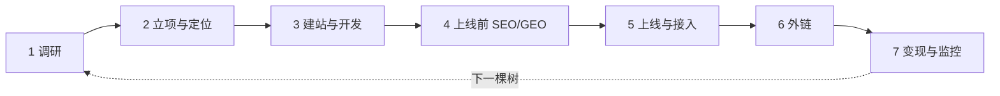
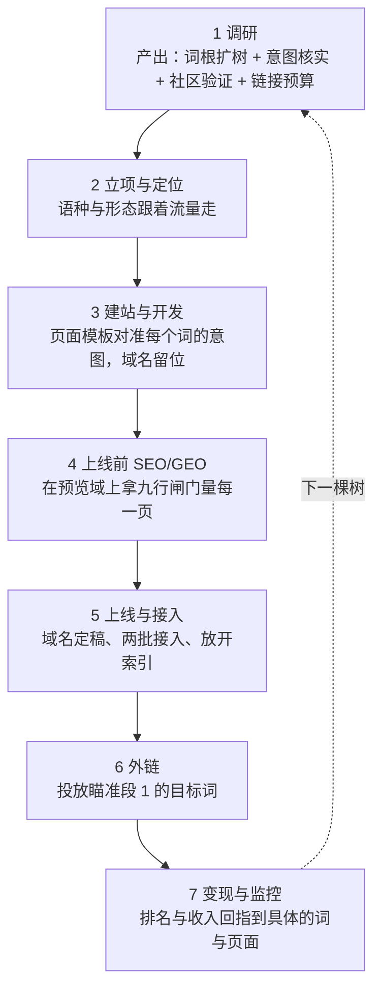

# yan-skills

给做 SEO 和独立开发的人用的 Agent Skills。**建站、选词、发外链、查数据、复盘迭代**，一整条链路都在这个仓库里，装完就能跑。

作者 [Yan](https://github.com/yan-labs)，自用打磨，实测可跑。兼容 Claude Code、Codex CLI、Cursor，以及任何读 `SKILL.md` 的平台。MIT 协议，随便拿去用。

```bash
npx skills add yan-labs/yan-skills -g --all
```

---

## 这套东西解决什么问题

做独立站的人，一天里大概是这么过的：

早上想做一个新方向，先去查这个词有没有量、难不难做。工具官网一个月两百刀，买不起，于是开十几个标签页手动比对。中午定了词，开始搭站，脚手架、Cloudflare、域名、GA、GSC，一套流程走完两天，下次做站再走一遍，还是踩同样的坑。下午要发外链，翻出别人分享的「500 个免费外链网站」清单，点开前二十个，十七个打不开、两个要注册审核、一个要求你先给他挂链接。晚上打开 GSC，看到「已抓取但未编入索引」，不知道该改内容还是该再提交一次。

三个月后换个项目，上面这一整套，从头再来一遍。

**这个仓库要干掉的就是「从头再来一遍」。** 它把上面每一步都固化成脚本、数据文件和判定规则，让 AI Agent 直接照着执行。

三个主力 Skill 加一个配套的生图 Skill，分工很清楚：

| | 管什么 | 一句话 |
|---|---|---|
| [`rankup`](rankup/) | 网站的**全生命周期** | 从「这个词能不能做」到「上线三个月后该改哪一页」 |
| [`backlink`](backlink/) | 外链与**登录态数据** | 去哪发、能不能发、发完有没有真的生效 |
| [`opencli`](opencli/) | 浏览器与**取数的底层** | 怎么把用户那个已登录的 Chrome 开对，怎么不让两个任务抢同一个标签页 |
| [`imagegen`](imagegen/) | 网站的**视觉素材** | logo、吉祥物、og 图、内页配图、用户场景图、手绘插画——真实生成，页面上不许留占位图 |

小游戏每日自动化由 [`game-opportunity`](game-opportunity/) 的 `collect-checklist` 和
`decision-checklist` 两种模式分别执行 10 项采集与决策验收；
详细规则统一维护在 [`game-opportunity`](game-opportunity/) 中。

---

## 我该用哪个 Skill

你不需要知道这些 Skill 里有什么。**说你要做的事就行**，下面这张表负责分流。
左列是真实会说出口的话，右列是该加载哪个 Skill——每个 Skill 内部还有一层
「一句话 → 用哪个能力」的索引，进去之后不用再猜。

| 你大概会这么说 | 用这个 |
|---|---|
| 「我想做个新站」「这个词能不能做」「帮我选词」「挖点需求」 | [`rankup`](rankup/) |
| 「网站没流量」「排名掉了」「GSC 里这条什么意思」「现在该做什么/到哪一步了」 | [`rankup`](rankup/) |
| 「部署到 Cloudflare」「接个支付」「上线前检查」 | [`rankup`](rankup/) |
| 「AI 搜索怎么优化」「怎么被 ChatGPT 引用」「llms.txt」 | [`rankup`](rankup/) |
| 「帮我搞点外链」「去哪发」「提交目录」「评论外链」 | [`backlink`](backlink/) |
| 「这些外链有没有毒」「要不要 disavow」「竞品的外链哪来的」 | [`backlink`](backlink/) |
| 「上次发的到底生效没有」 | [`backlink`](backlink/) |
| **「Semrush / Similarweb 能查什么」「这个报表在哪」「这个站没有 API，把数据给我」** | [`backlink`](backlink/) → 它会带你去 [`platforms/`](platforms/) 的 64 页平台手册 |
| 「今天有什么新游戏词」「小游戏机会日报」 | [`game-opportunity`](game-opportunity/) |
| 「有没有现成的 skill 能做 X」「我想写个 skill，别人写过没」 | [`skillsmp`](skillsmp/) |
| 「用我的浏览器打开」「登录后台查一下」「标签页被抢了」「doctor 报错」 | [`opencli`](opencli/) |
| 「一句话，你自己拆解自己跑完」 | [`autopilot`](autopilot/) |
| 「生成 logo / 吉祥物 / og 图 / 内页配图 / 用户场景图 / 手绘插画」 | [`imagegen`](imagegen/) |
| 「让 Codex 在后台跑一轮」 | [`codex`](codex/) |
| 「skill 没生效 / 目录重复 / 链接坏了」 | [`skill-link-check`](skill-link-check/) |

三条容易走错的边界：

- **想查数据 ≠ 直接开浏览器。** 关键词、趋势、竞品先看 `rankup` / `backlink` 里有没有
  现成脚本；只有确实需要登录态、且没有脚本和 adapter 时才落到 `opencli`。
- **`opencli` 是底层，不是业务。** 它只回答「怎么把浏览器开对、数据怎么取回来」，
  不回答「该发哪个外链」「该做哪个词」。
- **调研互联网内容不在本仓库。** 那是 `agent-reach` 的事，本仓库不重复它。

---

## `rankup` — 网站全生命周期总控

版本 `3.8.8`。它不重复实现 Wrangler、Stripe 或趋势工具，它负责把这些能力串成一条长期可维护的工作流，并且记住你在每个项目上做过什么。小游戏站另有一条从新词监控、iframe 供给、可玩页面、广告到持续迭代的[专用链路](rankup/references/game-sites.md)。

登录态数据平台可以直接走薄 CLI，把一次探路沉淀成可续跑清单：

```bash
npx @yan-labs/rankup catalog semrush --json
npx @yan-labs/rankup capture semrush keyword-overview --keyword "photo signature resizer" --db us --out-dir .rankup/provider-audit/keyword-us
npx @yan-labs/rankup audit similarweb --manifest .rankup/provider-audit/similarweb.json --out-dir .rankup/provider-audit/live/similarweb --resume
```

### 3.0 改了什么

- 主文件 `rankup/SKILL.md` 从 979 行压到 300 行以内：只剩总路由表、七段各一节硬规则、红线速查与三个命令；执行纪律、红线细则、事故复盘全部搬到 [`references/discipline.md`](rankup/references/discipline.md)。
- 调研改为**词根扩树**：用户给的任何词都是词根，先直接搜再扩成树（最多两层）；原 P2「这个词能不能做」与 P3「扩词」合并为一条流水线，见 [`references/playbooks/research.md`](rankup/references/playbooks/research.md)。
- 域名接入移到上线前最后一步（段 5），定稿前加**黑历史裁决**闸门；平台接入拆成「域名无关 / 域名相关」两批。
- 新增 [`references/monetization.md`](rankup/references/monetization.md)：Stripe / PayPal / 广告 / 订阅 / 商店上架，只写路由与判据。
- 新增 `scripts/demand/suggest.mjs`：Google / Bing / DuckDuckGo 下拉联想，纯 HTTP 零配额，按语种带 `--hl` / `--gl`。
- 新红线：**任何页面不得出现占位链接 / 占位文案 / 占位图片**——Google 据此判垃圾站。

### 它覆盖的七段生命周期

3.0 把原来的 `0 1 2 3 4 5 6 7 7.5 8 9 10` 十二个阶段重排成七段。旧号与新段的对照表在 [`references/lifecycle.md`](rankup/references/lifecycle.md) 顶部，项目里旧的 `.rankup/checks.md` 按它换算，不用重写。

| 段 | 名称 | 出口判据（一句话） |
|---|---|---|
| 1 | 调研 | 任何词都是词根：直接搜 → 扩树 → 取量 → 社区验证（Reddit / X / YouTube / B 站近 14 天）→ 亲眼看 SERP 核实意图 → 折成钱；每个词有做/不做的裁决 |
| 2 | 立项与定位 | 第一目标是拿到流量并选定语种；某语种量大竞争小就**只做单语站**；意图类型决定产品形态与变现方式 |
| 3 | 建站与开发 | 一律 shadcn monorepo 脚手架 + GitHub 私有仓 + Cloudflare；域名做成一处配置留位；页面上零占位 |
| 4 | 上线前 SEO/GEO | 在预览域（noindex）上过完九行闸门 + 封板声明；每次页面改动全套重跑 |
| 5 | 上线与接入 | 批 A 域名无关接入 → 域名黑历史裁决 → 绑域名 → 批 B 域名相关接入 → 放开索引，一个不漏 |
| 6 | 外链 | rankup 只判什么时候发、发多少，执行交给 `backlink` |
| 7 | 变现与监控 | Stripe + PayPal 先有；监控读数触发回到段 1 开下一棵树 |



逐段展开：

```
1  调研：词根扩树、取量与 KD、社区验证、SERP 意图核实、竞品变现、折成钱
2  立项与定位：流量第一、语种裁定、意图 → 形态 → 变现、写清「1」的定义与放弃条件
3  建站与开发：shadcn monorepo 初始化、私有仓、Cloudflare 按需启用、域名留位、hello@ 邮箱、无占位
4  上线前 SEO/GEO：每页目标词与密度、独立 TDK/OG 含图、llms.txt、九行闸门、封板声明
5  上线与接入：批 A（GA4、Clarity、CF WA）→ 域名黑历史裁决 → 绑域名 → 批 B（GSC、Bing、Yandex、Naver、IndexNow、Ahrefs、Email Routing）→ 放开索引
6  外链：节奏按 KD → 引荐域对照表，执行交给 backlink
7  变现与监控：Stripe + PayPal、广告 / 订阅 / 商店、监控读数触发下一棵树
```

每段开头都有一个固定动作「对账」（原阶段 0）：回答「项目现在真实在哪」，答不出来不进任何一段。已经在跑的老站从当前段接入即可，不会强制从段 1 重走。

### 每段交给下一段什么

七段不是七件孤立的事，是一条交接链：段 1 定下的目标词树，段 2 拿去裁定语种与形态，段 3 拿去对准页面模板，段 4 拿它逐页量密度与 TDK，段 6 的外链照它瞄准，段 7 再把排名与收入归因回它。任何一环把这份交接漏掉，链路就断在那里，后面的阶段会拿着一份对不上号的清单继续往下做。



每段末尾都有一张「交给下一段的」表，写清楚交付物、下一段怎么用、缺了会怎样——这不是装饰，[`references/lifecycle.md`](rankup/references/lifecycle.md) 段 1 到段 7 每段都有。

这条规则还有一半藏在文件之间：`.rankup/keywords.md` 这类被多处引用的清单一旦改动，要先找出谁在引用它，尤其是判定条件和放弃条件里的引用。真实发生过的失误：一份目标词清单从 8 个词收缩到 4 个，但另外三份文件的通过/放弃判据仍然锁定在「这 8 个词」上——于是一个已经被剔除的词只要自己涨进了前 20 名，会被误判成阶段目标达成。**改一份被引用的清单前，先 grep 谁在引用它。**

### 上线前的硬闸门（段 4，预览域 noindex）

段 4 里最要紧的是这九行（闸门 0–6 加 4b 加 4c），全部在预览域上做完，逐行要证据，不是工具清单。域名此时还没定稿，这些检查与域名无关：

| # | 检查项 | 证明什么 |
|---|---|---|
| 0 | 站点身份 | OG 元数据、图标全集、`manifest.json` 引用全部命中真实文件 |
| 1 | 技术 SEO | sitemap 与真实 URL 集合一致、零 404，`llms.txt` 不是模板占位 |
| 2 | TDK | 全站（不是抽样）title/description 互不重复，每页恰好一个 `h1` |
| 3 | 关键词密度 | 声明的目标短语与实测的短语是同一个字符串 |
| 4 | GEO / AI Agent 就绪度 | `is-agentic.mjs` 基线报告，每条 `partial`/`failed` 独立核实过 |
| 4b | GEO 内容形状 | 内容页有带出处的 Sources 节与规格表、FAQ 是 H3、JSON-LD 带 author / datePublished / dateModified |
| 5 | 哥飞 AI 审阅 | 每条建议有采纳/拒绝记录，拒绝必须附理由 |
| 6 | 性能 / Core Web Vitals | 首页、工具页、内容页三类都达标，现场数据优先于实验室数据 |

**命令跑了但证据没落进 `.rankup/`，不算通过。** 口头「应该没问题」或控制台一个绿色图标都不算证据，见 [`references/lifecycle.md`](rankup/references/lifecycle.md) 段 4 C 节与 [`references/checklists.md`](rankup/references/checklists.md) 段 4。每次页面改动，这九行全套重跑，不许只重跑改到的两行。

### 三个命令，覆盖 90% 的日常

**`rankup check`** — 「现在该做什么」「一步步来」时的唯一动作。读 `references/checklists.md` 与项目 `.rankup/checks.md`，找到第一个没过闸的段，逐项去真实代码、线上响应、后台读数核对，然后直接照着做。它保持轻量、零配额；命中升级判据（已上线但没有 `audit.md`、动过线上 URL 却超过一轮没体检）时会明说「这已经不是 check，是 review」。

**`rankup init`** — 把一个项目接进来。新项目适用，做了很久却还没有项目记忆的项目更适用（这才是常态）。

它会读 `package.json`、路由清单、部署配置、`git log`，实时去查域名解不解析、Cloudflare 在不在跑、GSC 接没接、有没有支付，**一律实时查询，不采信任何文档里的说法**。然后建立 `.rankup/` 项目记忆目录，已上线的站补一次流量、索引、性能、收入基线，出一份技术体检，最后落成 roadmap 和 P0–P2 计划。绿地项目在脚手架跑通后立刻建仓推远端，**远端默认私有**，因为未上线项目的仓库里带着选题和竞品调研，公开等于把选题送人。

**`rankup review`** — 定期回头看。

先跑只读体检脚本，拿到机械结论：缺哪些文件、哪些记录超期、脚本的已验证日期过没过期、经验库里有没有重复条目。然后做一件别处很少有人做的事情：**去挖你自己的对话记录**。

```bash
node scripts/sessions.mjs --project-root . --days 14 --new-only --dump
```

最有价值的经验往往还留在对话里，从来没进过任何文档。这个脚本把 Claude Code 和 Codex 的会话浓缩成只剩人说的话和结论，按字节偏移记水位线，上次读到哪这次就从哪接着读。你要在里面找四类东西：用户的纠正、验证过的结论、踩过的坑与根因、已经推翻旧记录的事实。

### 开箱即用的选词与数据能力

**`scripts/seo-webcafe.mjs`** — 一个脚本打通[哥飞](https://seo.web.cafe)那套 SEO 工具箱里所有带后端的工具：

| 子命令 | 回答什么问题 |
|---|---|
| `kd` | 这个词难不难做，前九名是什么盘面 |
| `serp` | 谷歌第一页每个结果凭什么排在那 |
| `audit` | 这个页面 40+ 项体检，扣分扣在哪 |
| `backlink` | 对方开的外链报价值不值 |
| `worth` | 这个站按流量和变现方式值多少钱 |
| `history` | 这个域名前世被谁用过 |
| `chat` | 直接问站内的 SEO Agent |

2026-08-24 复查把这个站的 **21 个工具全部纳入**：补上一直缺的 `translate` 需求翻译器、
`mine` 需求挖掘机、`domain` 起名与域名核验（早期没接不是没后端，是当时配额先耗尽了）；
把 4 个确认无后端的工具的公式复刻成**本地命令** `kgr` / `string` / `money` / `email`
（零网络、零配额、支持 `--batch`）；另外 4 个附证据标注不做，跑 `tools` 命令可以看到理由。
同一次复查还发现 `adsense` 已经坏了一段时间——站方把返回从 JSON 换成了 SSE，
而脚本仍按 JSON 解析，**静默返回空且不报错**，已修。

配套 **`scripts/gefei-ask.mjs`** 走另一条路：驱动**你已登录的浏览器**去问哥飞的 SEO Agent 并取回全文，
全程不碰会话 Cookie（那枚是 HttpOnly，脚本本来也读不到）。两条路径互补不是替代——
有 Cookie 想无人值守就用 `seo-webcafe.mjs chat`，只有登录态浏览器就用这个。

**零配置可跑；配额档位以脚本打印为准**——早先写死的「匿名 10 次/日」已被真实事故推翻，不要再信文档默认值。接口地图是 2026-08-07 用真实浏览器会话逐个工具点网络面板得到的，每个工具只发了一次请求，没跑循环、没登录、没绕配额，记在 [`references/seo-webcafe.md`](rankup/references/seo-webcafe.md)。

**`scripts/webcafe-forum.mjs`**（+ `webcafe-transport.mjs` / `webcafe-rsc.mjs`）—— [哥飞社区论坛](https://new.web.cafe)全站取数，
`get <任意站内 URL>` 一条命令取回内容，认不出的 URL 退回通用抓取。覆盖悬赏问答（含征集型的众筹榜单与提交理由）、
经验 91 条 / 帖子 722 条 / 教程 40 个专栏、站内搜索，以及**「哥飞的朋友们」14 个微信群归档搜索**
——那份归档就是站内 AI 助手的知识库，直接搜拿到的是原话，不消耗任何 AI 额度。
接口地图与坑记在 [`references/webcafe-forum.md`](rankup/references/webcafe-forum.md)。

> 这个站**匿名不会 401**：同一个端点匿名照样返回 200 和完整条目，只把正文换成空串、票数归零。
> 所以「拿到了吗」不能看状态码，要看正文空不空——脚本用 `access` 字段区分
> 「没登录 / 答题期封存 / 要花钱解锁 / 拿全了」四种，**绝不自动解锁**（那要花钱）。

**`scripts/gt.py`** — Google Trends。热度对比、地区分布、相关飙升词、每日热搜四个子命令，默认浏览器路由（驱动已登录 Chrome），`--via pytrends` 已停用指向 `scripts/archive/gt-v1/`。配套 [`references/trends.md`](rankup/references/trends.md) 里有三套工作流：小语种市场探测、把模糊方向收敛成真能做站的词、新兴趋势捕捉。

**`scripts/demand/` 一整组（24 个脚本，含 3.0 新增的 `suggest.mjs` 三引擎下拉联想）** — 需求挖掘取数，配套 [`references/demand-sources.md`](rankup/references/demand-sources.md) 那张源 → 脚本路由表；**另有十余个没有脚本的手工源**（差评矿、用户原话、CT 子域名监控等），底账见 [`references/capability-map.md`](rankup/references/capability-map.md)。

用户说「找几个关键词」「挖点需求」「最近有什么能做的」时的入口。**路由表按「你现在缺哪一类信号」组织，不按站点类型**：谁已经收到钱了 / 谁在花钱买流量 / 谁做了但没做好 / 谁在为这件事付外包费 / 正在冒出来的新产品 / 持续涌现新词的平台 / 用户的原话 / 竞品正在往哪儿下注。拿到候选之后统一走同一条验证链路（域名画像 → KD → SERP 盘面 → 流量面板 → 趋势）。

来源是社群一个悬赏帖里 23 条回答提到的全部站点，**每一条取数路径都在 2026-08-23 逐个发过真请求验证**，不是照文档抄的。因此路由表里同时记着一批「省一整轮试错」的实测结论——比如某个游戏平台的官方 app list 接口已经下线、某评论平台的 `.json` 端点现在一律 403、某 AI 导航站是环境级不可达（真实浏览器也救不回来）、某个「收入榜」其实根本不给收入数字。**「取不到」也是结论，不编字段。**

一条贯穿这组脚本的分界线值得单独记：**「必须真实浏览器」和「必须登录态」是两件事。** 大部分站只是要绕反爬质询，不需要任何账号；真正需要登录态的极少。混为一谈会让人白配一堆凭据，或者反过来——用没有登录态的环境去查需要登录的面板，拿到**看起来正常但内容不同**的结果。

**`scripts/indexnow-submit.mjs` + `scripts/webmaster-sitemap.mjs`** — 搜索平台接入这一整段，配套 [`references/search-platforms.md`](rankup/references/search-platforms.md)。

新站每次都要原样做一遍的事：放 IndexNow 密钥、推一次全量、在 Bing 和 GSC 里验证所有权、两边提交 sitemap、之后每次发版增量推。顺序表里 **IndexNow 排在站长工具前面**——它一个账号都不欠，一个密钥文件就是全部凭据，排到后面等于白等账号问题解决的那几天。

三件值得单独说的：

- **推送脚本先校验密钥文件再提交。** 密钥不可达时整批提交被丢弃，而接口照样回 200 —— 没有这一步，「推送成功」这句话在密钥没部署、拼错、或被静态资源抢答时**逐字一样**地打印出来。
- **URL 列表从线上 sitemap 取，不在脚本里维护数组。** 硬编码数组必然与实际发布的页面漂移，而漂移方向永远是「新页面没推」。
- **两条不代替用户点**：站长工具的「授权访问你的 DNS 服务商账号」，以及 Bing 的「从 GSC 导入」。后者省几分钟，换来的是 Bing 对用户 Google 账号的长期 OAuth，而一行 meta 标签效果完全相同。

sitemap 提交走用户已登录的浏览器，因为这里**确实没有零配置 API**（GSC 那侧要建 GCP 项目跑 OAuth；Bing 有一键 API key，项目拿到了就该改走纯 HTTP）。文档里记着四个实测的坑，包括「`extract` 会把后台的 base64 内嵌图片一起吐出来，实测一次 127 万字符」和「`--name` 是包含匹配，GSC 上「提交」会和「提交反馈」撞词」。

### 经验库：`references/experiences/`

这是 Skill 的**经验层**——从业者用真金白银换来的裁定，按使用时机分四本，
和方法层（其余 `references/*.md`）分开放：方法层回答「怎么操作」，经验层回答「该怎么判断、别人踩过什么坑」。
每条都带出处与证据等级（【实测】/【经验】/【猜测】），收录规则写在 `experiences/INDEX.md`。
硬约束是经验层不带任何项目信息——站名、域名、流量数字一律留在项目侧的 `.rankup/experience.md`。

- **`experiences/demand-discovery.md`** — 前期调研：反推「谁已经在赚钱」的六条通道（支付网关引荐流量算到达付费页比例、长尾支付网关、广告投放数据、应用商店付费榜与差评、淘宝闲鱼销量、大厂会员功能表）、一条可全自动的筛选流水线（榜单 → 流量面板 → 阈值 → 排除品牌词，实测约 300 个产品筛出 1 个）、判断需求值不值得做的五条认知。
- **`experiences/zero-to-one.md`** — 0→1 的规划与迭代纪律：先把「1」定义死、三道关的顺序、**虚荣指标 vs 验证信号**（一批人 + 没优惠 + 没人工解释 + 自然付款不退，四条同时成立才算数）、漏斗卡点的三分法、**打磨 > 重构**、先手工跑通再自动化、一张含冲突裁定的上线执行清单。
- **`experiences/conversion.md`** — 转化与行为数据：动页面之前先查上游流量意图、先用后注册、CTA 写结果不写动作、每访客收入 = 付费率 × 客单价、定价页手法按可采纳性分三档（含明确不采纳的暗黑模式）、低频刚需产品「上来就弹付费」的非共识及其边界。
- **`experiences/webcafe-experiences.md`** — 哥飞经验帖的十五条可执行裁定，已经译成 Agent 能直接照着判断的形式：

- 别救老站，换域名重开
- 同一套模板换品牌词上 N 个站，等于把自己重复 N 次
- 多语言不要一键翻译，每种语言重新找词
- 网站没做完，不要用正式域名上线
- 想让谷歌显示品牌名而不是域名，六处一起写
- KGR 用 `intitle` 加引号，且自己验一遍
- 流量全来自品牌词、功能词没量，首页不用改
- 瞄准大词却只出小词，不代表选词错了
- 「已抓取但未编入索引」是内容问题，反复提交没用
- 页面基本盘是下限，不是目标
- GSC 数据只留 16 个月，滚动删除
- 域名只要还有外链就续费
- Bing 比谷歌好做是错觉，成因是 On-Page 门槛
- GEO：被推荐的入口已经不只是谷歌
- 工具选型，含价格现实

### 项目记忆：`.rankup/` 是一部 Wiki，不是一本日志

每个网站在自己仓库里存一份 `.rankup/`。核心原则只有一条，其余规则都是它的落地：**`.rankup/` 里除 `journal/` 外的一切都是持续修订的 Wiki，不是按时间追加的流水账。**

- 日志回答「某天发生了什么」——只增不改，永久保留，按时间读。整个 `.rankup/` 里只有 `journal/` 是这一类。
- Wiki 回答「现在什么是真的、为什么」——原地修订，按主题读。**一个结论被推翻后，要在它最初出现的位置改写，不是在更晚的地方补一句反驳完事。**

这条原则要防的失效场景是具体的：读者翻到一处措辞笃定的旧结论，照着做了决定，而真相是它已经被推翻——读者没有任何办法察觉。真实发生过的例子：某项目记录「这三个页面都已收录」，几天后其中两个掉出了索引，笔记却还停在现在时态，后续任务照着这句已经不成立的话继续判断。密钥文件只记名称、用途、环境和 Secret 系统位置，真实值永远不进 Git。

归属分三层，互不混淆：

- **Skill 层**只带剥离站点后仍然成立的通用方法。`scripts/validate-rankup.mjs` 会做机械断言，出现站点名、绝对路径、本机代理或凭据位置就构建失败。
- **项目层**的事实、数字、裁决与可复用脚本，留在各自的 `<project>/.rankup/`。
- **本机层**的 `registry.md` 是跨项目资产索引，由 `scripts/registry.mjs scan` 生成。它含项目路径，所以被 gitignore 排除，并且有断言拦住 `git add -f`。

开工前先查这张表：别的项目已经写好的脚本，直接去那个路径取，不要重写一遍。

### 默认建站栈

```bash
pnpm dlx shadcn@latest init \
  --preset b1D0eCA4 \
  --template start \
  --monorepo \
  --rtl \
  --pointer
```

Cloudflare-first：SSR 与 API 走 Workers，事务数据走 D1，文件与导出物走 R2，读多写少的配置走 KV，异步多步任务走 Queues / Workflows，强一致协调走 Durable Objects，真实密钥走 Worker Secrets 或 CI Secrets。资源按实际需求启用，不因为「以后可能需要」提前创建。

脚手架的四个坑每一条都实际踩过，写在 [`references/lifecycle.md`](rankup/references/lifecycle.md) 段 3 · 3.1「脚手架四个坑」。

---

## `backlink` — 外链与登录态数据

`SKILL.md` 是 XML 结构的 v3.0。理由写在文件开头：这个 Skill 的主体是法则和路由，而一条容易被略过的法则，就是一条会被违反的法则。打了标签的块，让「我刚才违反了哪一条」这个问题有名字可答。

**34 个脚本 + 19 篇方法论 + 4 个机读数据文件。**

### 数据资产：这是这个 Skill 最贵的部分

数据文件是资产，参考文档是「怎么用它，以及怎么不骗自己」。全部机读、可提 PR、有 JSON Schema、有 CI 门禁。

**`data/submission-targets.json` — 492 个可提交入口，按闸位分好类：**

| 闸位 | 数量 | 含义 |
|---|---:|---|
| `account` | 162 | 要注册账号 |
| `open-form` | 131 | 开放表单，直接填 |
| `captcha-interactive` | 112 | 交互式验证码，人工过闸 |
| `reciprocal` | 38 | 要求互链 |
| `captcha-passive` | 19 | 隐形验证码 |
| `personal-contact` | 18 | 得找人聊 |
| `email-verify` | 4 | 邮箱验证 |
| 其余 | 8 | 人工复审 / 没找到入口 / 未知 |

这份库的来源之一是社区流传的第三方清单，但每一条都经过实测复核。**举个例子：一份第三方清单去重后 235 个目录，三批并行验完，按「免费 + 免注册 + 免验证码」判定，直接能提交的只有 13 个，开放率 5.5%；另有 48 个已经死了（占 20%，其中一部分仍返回 200，内容已被改成加密货币推广页）。** 这个比例本身就是最有价值的信息，它能让你不再为一份「743 条免费外链」的清单浪费一整个下午。

**`data/free-channels.json` — 27 个能直接发出链接的渠道，其中 25 个免注册。**

**`data/paid-platforms.json` — 141 个实测观察到承载付费投放的平台**，按有多少个独立站点在用来排序。竞品在哪买的链接，这份表能给你答案。

**`data/index-submission.json` — 只收 URL、不给链接的收录提交渠道。** 它单独成表，因为它永远不该进外链台账。而且写死了一条规则：`indexed` 必须指名引擎，写 `indexed@google` 或 `indexed@brave`，不许写一个光秃秃的「已收录」。

### 五条浏览器法则

任何浏览器动作之前先读 [`references/browser-runtime.md`](backlink/references/browser-runtime.md)。核心的几条：

1. **只用用户自己的浏览器。** 通过 OpenCLI 复用已授权会话，脚本永远不输入密码。面板处于登出状态时，脚本报错让本人去登，而不是自作主张。
2. **一律走脚本，不手工点界面。** 手点的结果每次形状不一样，不可比，踩过的坑要重踩。
3. **浏览器不是纯 HTTP 的超集。** 隐形验证码只在原始 HTML 里露馅，渲染完就看不见了。
4. **会话按对话隔离**，标签页不许串。
5. **输出看着正常，数据可能已经错了。** 现代数据网格没有 `<table>` 和 `<tr>`，虚拟滚动会让你静默丢行。所以行数自查分两级，把虚拟滚动和正则盲区分开报。

### 提交安全：三道闸

`inspect-page.mjs` 先探这个页面有没有可提交的表单 → `safe-fill.mjs` 填一份你已经审过的 payload，**永不提交** → `release-submit-guard.mjs` 只在你对这一次提交明确点头之后才放行。

批量投放另有一条泳道。一百条以上的时候，单目标循环是「每个目标都对、整个战役全错」的典型：正确做法是先只读预检整批、把所有验证码集中成一个人工队列，而不是让整批卡在第一个验证码上。幂等键、队列分片、断点恢复、逐动作授权，全在 [`references/batch-campaign.md`](backlink/references/batch-campaign.md)。

### 证据化验证：目录宣传不等于外链

投出去不算数。台账 `ledger.mjs` 走的是这条链：

```
candidate → qualified → filled → submitted → public → indexed@<engine> → rel_verified
```

最终公开页必须逐项核对 URL、重定向和 `rel` 属性。一个跳转到 `/out.php?id=123` 的链接，和一个 `rel="nofollow ugc"` 的链接，都不是你以为的那个东西。

### 顺带解决的一个通用问题：从没有 API 的后台批量取数

[`references/harvest.md`](backlink/references/harvest.md) 加三个 `harvest-*` 脚本，`harvest.browser.js` 是个**通用虚拟滚动表格提取器**，按 Y 坐标聚类重建行，列位自适应。

这套知识跟外链无关，广告平台后台、电商后台、任何没有 API 的 SaaS 报表都能用。做这类任务时照样加载 `backlink`，只读那一篇。

### 授权数据源

[`references/authorized-data-sources.md`](backlink/references/authorized-data-sources.md) 记录如何在你自己已登录的浏览器里，用脚本驱动第三方数据面板取数：批量流量筛查（一次登录、N 个域名、单域名 5 秒、可断点续跑）、单关键词的量与难度与分国家拆分、四份不给导出的表格报表。

表格报表会翻页，脚本要么传 `--all-pages`，要么就明确告警，不会安静地少给你几百行。

同一份文档里还记着一条**众包外链清单**：哥飞社区那场「网站上线之后，你会去哪些地方提交外链？」
的征集悬赏，162 人提交、汇成 588 条按票排序的榜单，**每条带提交者写的理由**（免费还是收费、
多少钱、能不能被 GSC 收录、有没有真实流量）。这是一份众人真金白银试过之后投票投出来的名单，
一条命令就能刷新（走 `rankup/scripts/webcafe-forum.mjs`，取法与坑见那一节）。

**仓库里不含任何账号和密钥。** 面板入口是公开 URL，账号活在你自己的浏览器会话里，读这个文件的人拿不到任何东西。

---

## `opencli` — 浏览器与取数的底层

版本 `1.0.0`。**用其它 Skill 之前先装它**——`rankup` 和 `backlink` 的浏览器动作全部落在这一层，规则集中在这里，那两个 Skill 只留判据和指针。

配套的 OpenCLI 本体也是我们自己维护的构建（[yan-labs/OpenCLI](https://github.com/yan-labs/OpenCLI)，Apache-2.0），**不要用 Chrome 应用商店那个版本**，理由见[前置依赖](#装-opencli-cli--浏览器扩展)。

它管的是**用户本机那个真实的、已登录的 Chrome**——通过浏览器扩展加一个本地守护进程。这一个事实决定了几乎所有规则：沙箱浏览器没有 cookie，它对需要登录的目标会返回**看起来正常但内容不同**的结果（配额更低、字段更少、国家库不同），而这种失败会伪装成「这个工具没有这项数据」。

### 最贵的一节是会话纪律

`opencli browser <session>` 里的会话名就是标签页的所有权声明。**「我的标签页被别人抢了」只有一个成因：两个任务挑了同一个名字。** 症状极其阴险——导航报成功，读回来的却是另一个任务的页面，全程零报错。

四条法律都带实测数据：三个 agent 各用独立会话名跑 4 轮 × 3 页面，跨 agent 抢占 **0 次**；三个 agent 共用名字 `work`，抢占 **3 / 12 / 2 次**，其中一个每一次读都读错。`tab new` / `tab select` / `open --tab` 三个都**静默**失败——一次三 agent 运行把用户的 Chrome 从 11 个标签页涨到 30 个孤儿页。

还有一条只在 agent 环境里存在的坑：**`$$` 在 Node 脚本里安全（同一个进程），在 Claude Code 的 Bash tool 里每次调用都变**——第一条命令 `open` 的会话名和第二条 `eval` 的对不上，`eval` 对着一个空白新标签页执行，agent 会以为页面没加载好而不断重试。

### 取数：先找那个免费导出按钮

滚动抓表是兜底手段。文档里记着四个反复踩到的坑：同名控件（一个走付费配额、一个免费导当前页，行为完全相反）、静默下载（点完页面毫无反馈，不代表失败）、导出触发器是 `<svg>` 没有 `.click()`、翻页后表格重挂载导致导出按钮消失几百毫秒。

落盘首选**本地接收端**——页面直接 POST 到只监听 `127.0.0.1` 的服务，绕开整条下载链路。**接收端端口不能写死**，理由和会话名不能写死完全同构：端口被占用时后台常驻的常见写法会静默失败，而页面的 `fetch` 照样返回 200，打到的是另一个项目的接收端。

### 排障里有一条通用判据

`doctor` 前两行绿、第三行红，说明守护进程和扩展都活着，坏的是命令路径——这类问题重启和重装都没用。**提示信息在逻辑上自相矛盾时（比如叫你「先用 open 打开一个 URL」，而挂掉的正是 `open`），先怀疑本地构建，不要照着提示打转。** 这条来自一次真实回归。

`references/` 下另有 adapter 的编写与自修复、三个 driver 的取舍对比、以及我们这个 fork 与上游的差异清单。

---

## 另外六个 Skill

### [`autopilot`](autopilot/) — 一句话到无人值守执行完

扔一句「把 bug 修了」「优化下性能」，它自动调查、分类、拆成 XML 阶段计划、选 Skill、定完成判定，然后无人值守跑到底，包括自动部署、自动 E2E、自动 code review，不跳阶段。调用它等于授权全自动执行，中途不问你。

无依赖。

### [`game-opportunity`](game-opportunity/) — 小游戏机会日报

每天把多语种游戏平台的 sitemap 新内页变成可挑选的候选：验活、合并多语言页面、查 Web.Cafe
KD 与 SERP、用 Semrush 核对搜索量、检查可玩供给，结果统一写入项目 `.rankup/`。真实入口是
`node game-opportunity/scripts/game-opportunity.mjs daily`，最终生成带候选链接和
`develop / research / watch` 决策的 `latest.md` 与 `latest.json`。

### [`skill-link-check`](skill-link-check/) — Skill 目录审计

检查 `.agents/skills` 和 `.claude/skills` 是否遵守「前者存真源、后者用符号链接镜像」的约定，输出孤儿目录、缺失链接、重复目录、断链和错误目标，给出需人工复核的修复命令。支持 JSON 证据输出。它只报告，不动你的目录。

Skill 装多了以后，「为什么这个 Skill 没生效」十次里有八次是链接的问题。

依赖 Python 3.10+。

### [`skillsmp`](skillsmp/) — 在 160 万份 SKILL.md 里搜技能

按关键词、分类、职业、语言过滤，专门挖那些写得好但没人知道的冷门 Skill。动手造轮子之前先搜一下。

### [`codex`](codex/) — 生图，以及把 Codex 当后台 sub-agent

主用途是**生成图片**：配图、插图、成套出图，走 Codex 内置的那个 OpenAI 生图工具。
次要用途是把 Codex CLI 当后台 sub-agent 使——代码分析、重构、review，或者组一支并行的 agent 队伍。
它**总是后台运行**：发起之后立刻把控制权还给你，需要时再去取结果。

依赖已安装并登录的 Codex CLI。

---

# 使用说明

### [`imagegen`](imagegen/) — 网站视觉素材的真实生成

版本 `1.0.0`。借 Codex agent 内置的图像生成能力出图：logo、吉祥物、og:image 分享图、内页配图、用户场景真人图、手绘/蜡笔风插画、海报。本 Skill 只管五件事——把需求翻成好提示词、把命令跑通、验收（缩略图接触印相、alpha 包围盒占比、独立盲评）、压缩、放进项目该在的目录。`rankup` 段 3/4 的「不许占位图、每页独立 og:image 必须有图」就靠它落地。

前置：`codex` CLI 已装并登录（`codex --version`），ImageMagick 可选（透明抠底与占比修正）。

```bash
npx skills add yan-labs/yan-skills --skill imagegen -g -y
```

2026-09-02 实跑：一张 1024×1024 透明 logo 加一张 1200×630 og 图，约 5 分钟，原图落 `~/.codex/generated_images/`，压缩后 og 图 JPEG 92 KB / WebP 27 KB。

## 安装

**先装 `opencli`。** `rankup` 和 `backlink` 的浏览器动作全部落在它那一层——
查数据面板、抓没有 API 的后台表格、提交外链、验证站长工具，都要经过它。
不装它，那两个 Skill 里凡是碰浏览器的部分都跑不起来。

```bash
# 0) 先装这个：其余 Skill 的浏览器动作都依赖它
npx skills add yan-labs/yan-skills --skill opencli -g -y

# 交互式选择要装哪些
npx skills add yan-labs/yan-skills

# 全局装齐全部
npx skills add yan-labs/yan-skills -g --all

# 只要 rankup
npx skills add yan-labs/yan-skills --skill rankup -g -y

# 只要 backlink
npx skills add yan-labs/yan-skills --skill backlink -g -y

# 更新
npx skills update rankup -g -y
```

Skill 只是给 Agent 的操作规范，**OpenCLI 本体（CLI + 浏览器扩展）要单独装一次**，
见下面「前置依赖」里的 OpenCLI 一节。

装完之后，直接跟你的 Agent 说人话就行，Skill 会自己被触发：

```
帮我看看 "ai headshot generator" 这个词能不能做
新建一个做生日石含义的内容站
rankup review
找找 example.com 的外链是从哪来的
这个站有哪些地方能提交
把这个后台的表格数据导出来
```

## 前置依赖

| 组件 | 谁需要 | 说明 |
|---|---|---|
| Node.js 18+ | 两个 Skill 都要 | 全部脚本的运行时 |
| Python 3.10+ | `rankup` 的 `gt.py`、`skill-link-check` | 首次运行 `gt.py` 自动建 venv |
| [OpenCLI](https://github.com/yan-labs/OpenCLI) CLI + 浏览器扩展 | `opencli` / `backlink` / `rankup` 的全部浏览器动作 | 复用你自己已登录的 Chrome。**必须装我们的构建，不是 Chrome 应用商店那个**，见下 |
| Wrangler / Stripe CLI | 按任务 | 只在真正走到那个阶段时才需要 |

### 装 OpenCLI（CLI + 浏览器扩展）

两半都要装**我们的构建**，来源是
[yan-labs/OpenCLI 的 Release](https://github.com/yan-labs/OpenCLI/releases/latest)：

```bash
# 1) CLI
npm i -g https://github.com/yan-labs/OpenCLI/releases/download/v1.8.7-yan.2/opencli-cli-1.8.7-yan.2.tgz
```

**2) 浏览器扩展** —— 下载 Release 里的 `opencli-extension-v*.zip`，解压到一个不会随手删掉的目录，
然后 `chrome://extensions` → 右上角开启「开发者模式」→「加载已解压的扩展程序」→ 选中那个目录。

```bash
# 3) 验证：三行都要 [OK]，Extension 那行的版本应 ≥ 1.0.32
opencli doctor
```

> **⚠️ 不要装 Chrome 应用商店里那个 OpenCLI。**
>
> 我们这个构建做了一件商店版没做的事：**自动化不抢你正在用的浏览器**——
> 后台是默认值、标签页开在你当前那个窗口里、不切走你的活动标签页，
> 另有 `--window isolated` 把自动化完全挪出你的窗口。
> 商店版默认是前台，装了它这几个 Skill 里写的规则会与实际行为对不上。
> **两个同时装还会一起连上本地守护进程互相打架**，装之前先把商店版移除或停用。
>
> `opencli doctor` 打印的扩展版本就是判据——它显示什么，加载的就是什么。

源码、完整差异清单与 issue 都在 [yan-labs/OpenCLI](https://github.com/yan-labs/OpenCLI)
（Apache-2.0，fork 自 [jackwener/opencli](https://github.com/jackwener/opencli)）。

`backlink` 的任何浏览器任务开始之前，先跑一次健康检查：

```bash
node backlink/scripts/health.mjs
```

## 令牌配置

**令牌只放各 Skill 根目录的 `.env`，绝不入库。** 仓库 `.gitignore` 已经排除，`rankup` 的 `validate-rankup.mjs` 会做断言，构建时拦下来。

```bash
# rankup/.env
SEO_WEBCAFE_TOKEN=     # 只有 kd 命令需要，wc_mcp_ 开头，去 /kd/docs 自助生成
                       # 旧键名 KD_TOKEN= 同样识别
SEO_WEBCAFE_COOKIE=    # 可选。给了就提高配额档位；具体档位以脚本打印为准，不要信写死的数字
                       # chat 命令强制登录，匿名会 401

# backlink/.env
TOOLS_SHARE_DASHBOARD_URL=      # 你自己的数据面板入口
TOOLS_SHARE_APP_ORIGIN=         # 落地 origin，用来校验点开的是哪个产品
TOOLS_SHARE_APP_ORIGIN_SEMRUSH= # 另一张卡的 origin

# skillsmp/.env（见 skillsmp/.env.example）
SKILLSMP_API_KEY=
```

大部分都不配也能用：`rankup` 除 `kd` 与 `chat` 外的全部子命令匿名即可跑，`backlink` 的数据库、方法论和填表守卫完全不依赖任何面板。

## 常用命令速查

### rankup

```bash
# 关键词难度 + 前九名盘面
node rankup/scripts/seo-webcafe.mjs kd --keyword "ai headshot generator"

# 页面体检 / SERP 归因 / 外链估价 / 域名前世
node rankup/scripts/seo-webcafe.mjs audit    --url https://example.com/page --keyword "your keyword"
node rankup/scripts/seo-webcafe.mjs serp     --keyword "keyword"
node rankup/scripts/seo-webcafe.mjs backlink --input example.com
node rankup/scripts/seo-webcafe.mjs history  --input example.com

# 需求翻译 / 需求挖掘 / 起名核验（2026-08-24 补全）
node rankup/scripts/seo-webcafe.mjs translateSearch --query "markdown to pdf"
node rankup/scripts/seo-webcafe.mjs mineSearch      --keyword "ai image upscaler"
node rankup/scripts/seo-webcafe.mjs domainIntent    --text "一个 AI 图片压缩工具站"

# 纯本地计算，零网络零配额，可 --batch 批量
node rankup/scripts/seo-webcafe.mjs kgr --volume 1000 --intitle 5 --kd 20

# 哥飞论坛：给个链接就取回内容（悬赏/经验/帖子/教程）
node rankup/scripts/webcafe-forum.mjs get https://new.web.cafe/ask/bounty/fd0wrgx7fh
node rankup/scripts/webcafe-forum.mjs chat-search "挖掘需求"   # 搜 14 个微信群归档

# Google Trends
python3 rankup/scripts/gt.py compare "keyword a" "keyword b"

# 项目体检（只读）
node rankup/scripts/review.mjs --project-root . --days 30

# 挖会话记录里没沉淀的经验
node rankup/scripts/sessions.mjs --project-root . --days 14 --new-only --dump
node rankup/scripts/sessions.mjs --project-root . --days 14 --mark   # 消化完才落水位线

# 跨项目资产索引
node rankup/scripts/registry.mjs scan --roots ~/Project

# 改完 Skill 必跑
node rankup/scripts/validate-rankup.mjs
```

### backlink

```bash
# 任何浏览器动作之前
node backlink/scripts/health.mjs

# 看看 492 条入口库里现在有什么
node backlink/scripts/targets-select.mjs --stats

# 取一个批次（open / captcha / account …）
node backlink/scripts/targets-select.mjs --cohort open

# 探一个页面的表单、登录与验证码状态
node backlink/scripts/inspect-page.mjs --url https://example.com/submit

# 填一份已审过的 payload，永不提交
node backlink/scripts/safe-fill.mjs --session <name> --scan ./scan.json --payload ./payload.json

# 别人发的外链清单，归一化 + 差异对比
node backlink/scripts/third-party-list-ingest.mjs --input ./list.md --out ./leads.json --new-only

# 批量流量筛查：一次登录，N 个域名，可续跑
node backlink/scripts/similarweb-batch.mjs --domains-file domains.txt --out traffic.jsonl

# 同一国家一次查最多 100 个词；入选词再单查全球量和主要国家
node backlink/scripts/semrush-keyword.mjs --kw-file words.txt --db us --bulk --out keywords-us.jsonl
node backlink/scripts/semrush-keyword.mjs --bulk-plan countries.json --out keywords-countries.jsonl

# 台账
node backlink/scripts/ledger.mjs list --state public

# 改数据必跑，CI 跑的就是这条
node backlink/scripts/validate-data.mjs
```

## 给这个仓库提 PR

数据文件欢迎补充，这是这个项目最值钱的部分。规则见 [`backlink/CONTRIBUTING.md`](backlink/CONTRIBUTING.md)，核心只有一条：

**证据规则。** 每一条渠道的状态都要有实测支撑，不接受「我看别人清单上有」。你说它 `open-form`，那就是你自己打开过那个表单；你说它 `indexed`，那就得指名是哪个引擎。

提交前跑通门禁：

```bash
node backlink/scripts/validate-data.mjs   # 必须 exit 0
```

## 本地开发

要改这些 Skill 本身，把全局技能目录直接链接到本仓库，让全局只存在一份真源：

```bash
git clone https://github.com/yan-labs/yan-skills.git
cd yan-skills

# 建立或修复链接（把被替换掉的实体目录先备份，不直接删）
node scripts/link-skills.mjs

# 只检查漂移，有问题退出 1，适合放 CI 或定期巡检
node scripts/link-skills.mjs --check
```

链接建立之后仓库里的改动即时生效，**这时不要再对这些 Skill 跑 `npx skills update`**，那会把符号链接换回实体目录副本，双份维护随之回归。

两道保护：

- `rankup` 的自动更新会检测仓库根的 `.skill-source` 标记，识别出自己正从源码运行时拒绝执行更新（`blocked / source-checkout`），所以定时检查不会覆盖你的本地改动。这个标记位于仓库根，而 `skills add/update` 只复制单个 Skill 子目录，所以它永远不会随安装副本分发，也不会误伤项目级安装。
- 万一链接还是被替换掉了，重跑 `node scripts/link-skills.mjs` 就能恢复。

## 常见问题

**Q：不装 OpenCLI 能用 `backlink` 吗？**
能。492 条入口库、141 个付费平台、19 篇方法论、外链质量评分与外联模板，全都是纯数据和纯方法，不需要任何浏览器。只有实际驱动浏览器取数和填表才需要。

**Q：不给 `rankup` 配令牌能用吗？**
基本能。`seo-webcafe.mjs` 除 `kd` 和 `chat` 之外全部匿名可跑，配额档位以脚本打印为准。`kd` 要一个自助生成的公开 API 令牌，`chat` 要登录态。`gt.py` 完全不需要令牌。

**Q：Skill 装了但没被触发？**
跑 `skill-link-check`。十次里有八次是符号链接的问题。

**Q：`rankup` 会不会把我的项目信息写进 Skill 里？**
不会，而且有机械门禁拦着。`validate-rankup.mjs` 断言 Skill 里不许出现站点名、域名、流量数字、property ID、绝对路径和凭据位置，出现即构建失败。项目侧的事实留在各自的 `.rankup/`，跨项目索引 `registry.md` 被 gitignore 排除。

**Q：这些数据多久更新一次？**
`backlink/data/` 每次实测都会回写，`updatedAt` 字段是权威。方法论文档写的是「已验证日期」，过期的会在 `rankup review` 里被标出来。

---

## 致谢

这些 Skill 吸收了其他开源项目的成果，在此致谢：

- **[flaqai/backlink_skills](https://github.com/flaqai/backlink_skills)**（MIT，Flaq AI）——`backlink` 的批量投放运维层来自这个项目：幂等键与队列分片、**验证优先**（先只读预检整批、把验证码集中成一个人工队列，而不是让整批卡在第一个验证码上）、逐动作授权、可断点恢复的状态集、锚文本策略，以及「已发布条目必须与已提交表单分开报」的报告纪律。见 [`backlink/references/batch-campaign.md`](backlink/references/batch-campaign.md)。他们公开的 `Free-backlink-list.md`（743 条渠道）也是本 Skill 迄今测过的最大一份第三方线索清单，归一化与差异对比的结果记在 [`backlink/references/instant-publish.md`](backlink/references/instant-publish.md)。需要说明的是，那份清单和那两个提交 Skill 在他们仓库里是分开的资产，Skill 本身不带渠道，URL 由使用者提供。
- **[aaron-he-zhu/seo-geo-claude-skills](https://github.com/aaron-he-zhu/seo-geo-claude-skills)**（Apache-2.0）——`backlink/references/` 下的质量评分矩阵、分析模板与外联模板。
- **[哥飞](https://seo.web.cafe)** —— `rankup` 的选词与体检能力建立在他做的 SEO 工具箱之上，`references/experiences/webcafe-experiences.md` 的十五条裁定也来自他公开的经验帖，经验库另外三本的素材来自 `new.web.cafe` 的悬赏问答。

### 已并入 `backlink` 的两个 Skill（2026-08-16）

原先的 `backlink-analyzer` 与 `browser-harvest` 已合并进 `backlink` 并删除，从三个减到一个：

- **`backlink-analyzer`**（外链质量、毒性与竞争缺口分析）本身是一套纯提示词模板，没有脚本也没有浏览器通道，能描述外链画像却拿不到画像。现为 `backlink/references/` 下的 `link-quality-rubric.md`、`analysis-templates.md`、`outreach-templates.md`，保留上游 Apache-2.0 许可证与归属。
- **`browser-harvest`**（从登录态后台批量取数）现为 `backlink/references/harvest.md` 加三个 `scripts/harvest-*`。**合并的代价照例说明**：这套知识本身是通用的，现在却挂在一个以外链命名的 Skill 下。做与外链无关的后台取数时，仍然要加载 `backlink` 再读那一篇。

同样，`gt`（Google Trends 与选词工作流）于 2026-08-16 并入 `rankup` 并删除，现为 `rankup/references/trends.md` 加 `scripts/gt.py`。合并时发现 `gt/scripts/kd.py` 和已有的 `scripts/seo-webcafe.mjs` 打的是同一个接口、用的是同一种令牌，只是两套实现两个变量名，于是删掉重复的那份。代价是 `gt` 原本的触发面现在要经由 `rankup` 才能到达，description 已补上那批词。

## License

除另有标注的第三方内容外，仓库内容采用 MIT License。`backlink/references/` 下三份分析模板来自上游 Apache-2.0 项目，许可证副本与归属说明保留在同目录的 `LICENSE-analysis-templates-Apache-2.0`。
